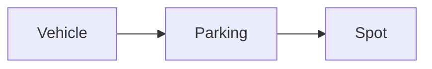
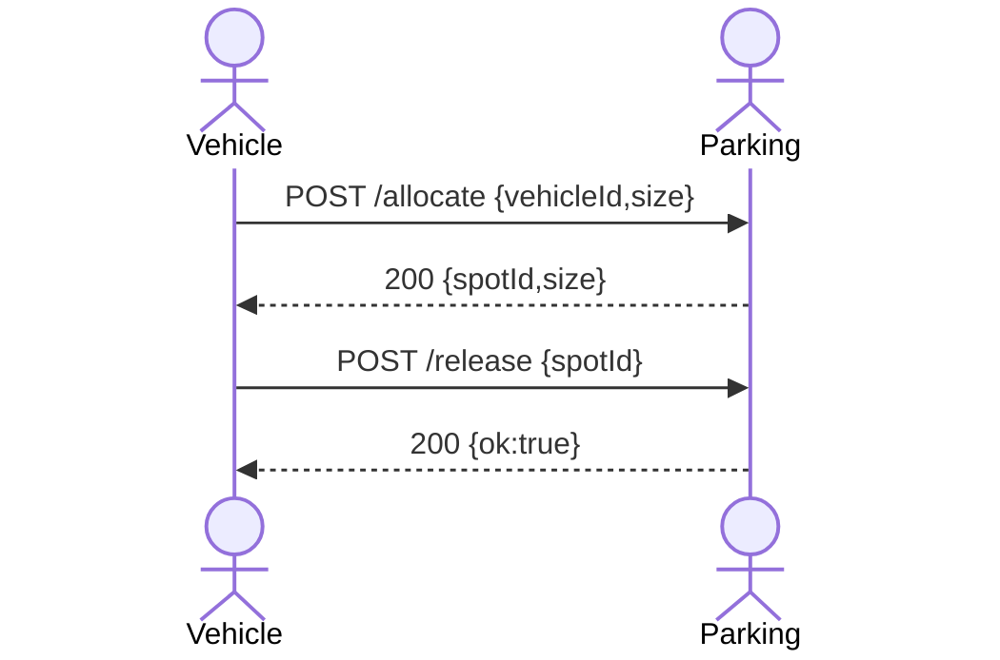
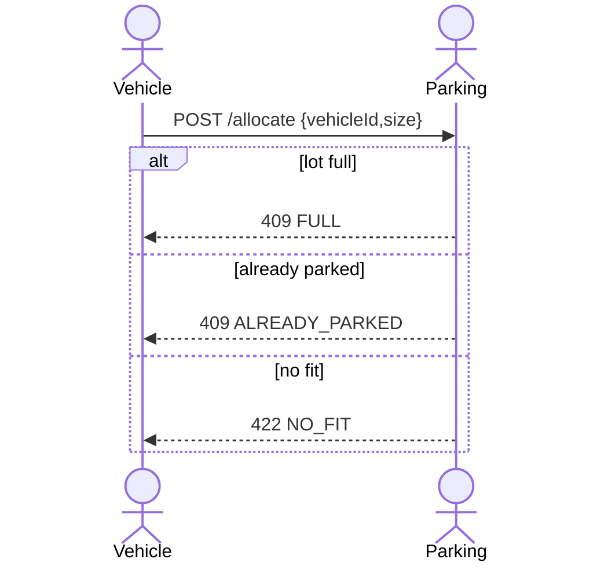

# Parking-Lot_Preset HLD

## 1. Problem & Scope

**Problem:**
manage smart parking by pre knowing how & which size of the free spots

**In Scope:**
Check free spots and update parking state and update when change happended.
Parking Saves stats.

**Out Scope:**
Payment
Auth

## 2. Assumptions & Constraints

- Users: <Max: 100>
- RPS: <Max: 30>
- Region: <Israel>
- Date size: <All-Time>

## 3. Actors & Context

**Actors:** <Vehicle>, <Parking>, <Spot>

## Interface

Base: /api/parking
Headers:
{Content-Type: application/json, Idempotency-Key: <uuid>}

### POST/allocate

Body: { vehicleId: string, size: "S" | "M" | "L"}
200: { spotId: string, size: "S" | "M" | "L"}
422: { error: "NO_FIT", message: "vehicle is too large for remaining spots"}
409: { error: "FULL", "message": "no free spots"}
409: {error: "ALREADY_PARKED", message: "this car already parked"}
400: { error: "BAD_REQUEST", "message": "invalid body: size must be S|M|L" }

### POST/release

Body: {spotId: string}
200: {ok: true}
404: {error: "NOT_FOUND", message: "spot not found or already free"}

### GET/stats

200: {
total: {S: 0, M: 0, L: 0, all: 0},
free: {S: 0, M: 0, L: 0, all: 0},
occupied:{S: 0, M: 0, L: 0, all: 0},
isFull: false/true,
isEmpty: false/true
}

### GET/health

200: {status:"ok"}

## Flows (Happy & Sad)

<!-- actor V as Vehicle
actor P as Parking -->

**Happy Path**

**Sad Path**

